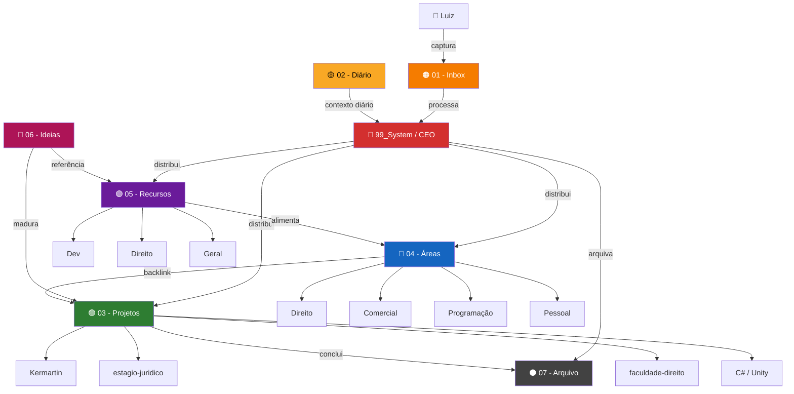
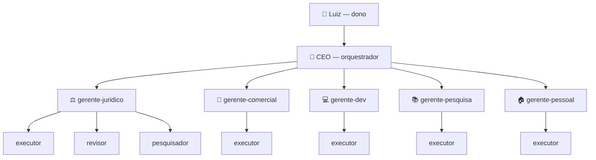
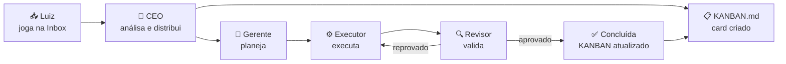

---
tipo: sistema
atualizado: 2026-05-13
tags: [organograma, estrutura, navegação]
---

# ORGANOGRAMA — Estrutura do Vault Cérebro

> Mapa visual completo: pastas, fluxos e hierarquia de agentes.
> Cores = categorias do Graph View e painel lateral.

---

## 🗂️ Estrutura PARA e Fluxo de Conhecimento

---

## 🤖 Hierarquia de Agentes

---

## 🔄 Fluxo de uma Tarefa

---

## 🎨 Legenda de Cores

| Cor | Pasta | Tipo |
|-----|-------|------|
| 🔴 Vermelho `#D32F2F` | `99_System` | Sistema / Controle |
| 🟠 Laranja `#F57C00` | `01 - Inbox` | Captura |
| 🟡 Amarelo `#F9A825` | `02 - Diário` | Temporal |
| 🟢 Verde `#2E7D32` | `03 - Projetos` | Projetos |
| 🔵 Azul `#1565C0` | `04 - Áreas` | Áreas de vida |
| 🟣 Roxo `#6A1B9A` | `05 - Recursos` | Referências |
| 🩷 Rosa `#AD1457` | `06 - Ideias` | Ideias brutas |
| ⚫ Cinza `#424242` | `07 - Arquivo` | Arquivado |

---

## 🗺️ Links Rápidos

- [[14_Indexes/MAPA]] — índice navegável
- [[99_System/TAREFAS]] — status e log de sessões
- [[99_System/KANBAN]] — painel visual de tarefas
- [[01_Dashboard/000-Dashboard]] — dashboard com Dataview
- [[04_Projects/moc-projetos]] — índice de todos os projetos
- [[10_Learning/Direito/moc-direito]] — MOC Jurídico
- [[10_Learning/Programação/moc-programacao]] — MOC Programação
- [[03_Entities/moc-comercial]] — MOC Comercial
- [[03_Entities/moc-pessoal]] — MOC Pessoal
